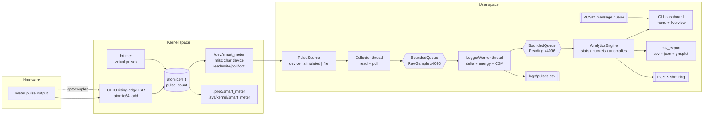
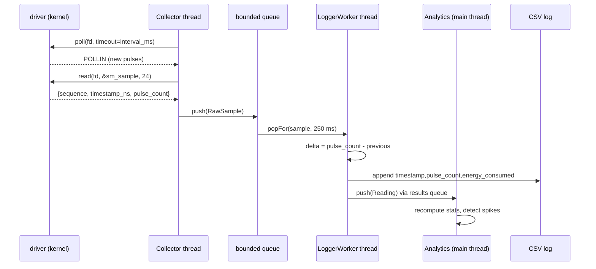

<<<<<<< HEAD
# Smart Meter – Pulse Counter & Analytics Agent

A Linux system, written entirely in **C/C++**, that reads the pulse output of a smart
energy meter, counts pulses in **kernel space**, converts them into energy units in
**user space**, and runs real-time analytics behind a terminal dashboard.

```
+---------------------------+        +---------------------------------------------+
|  Smart meter (hardware)   |        |  user_app / analytics + CLI dashboard      |
|  S0 pulse output ---------+------->|  CSV log -> stats -> hourly/daily -> spikes |
+---------------------------+  GPIO  +---------------------------------------------+
                                         ^                    ^
                                         |                    | POSIX IPC
                                    /dev/smart_meter    shm ring + message queue
                                         |
                              +-----------------------------------+
                              | driver/smart_meter_driver.ko      |
                              | hrtimer | GPIO ISR | atomic count |
                              +-----------------------------------+
```

## Project overview

| Layer | Files | Responsibility |
|---|---|---|
| Kernel | `driver/smart_meter_driver.c` | Character device, interrupt/hrtimer pulse detection, atomic cumulative counter, `ioctl`/`poll`, sysfs + procfs |
| User space | `user_app/pulse_source.cpp` | Device / simulator / CSV-replay sources behind one interface |
| User space | `user_app/collector.cpp` | Two `pthread` workers with a bounded queue (acquisition → CSV writer) |
| User space | `user_app/analytics.cpp` | Energy conversion, hourly/daily buckets, statistics, anomaly detection |
| User space | `user_app/file_io.cpp` | CSV logging and parsing |
| User space | `user_app/csv_export.cpp` | CSV + JSON + gnuplot export for visualisation |
| User space | `user_app/ipc_channel.cpp` | POSIX shared-memory ring and message queue |
| User space | `user_app/main.cpp` | Menu-driven CLI dashboard |
| Shared | `include/driver_interface.h` | The one ABI header compiled by both sides |

Every module is source-agnostic: the dashboard runs unchanged against the real driver,
an in-process simulator (no root required) or a replayed CSV log.

---

## 1. Kernel space: `smart_meter_driver.ko`

A `misc` character device at **`/dev/smart_meter`** with a dynamically allocated minor.

**Pulse sources**

* `SM_SOURCE_GPIO` – a GPIO line from the meter (or an optocoupler front end). The driver
  takes a rising-edge interrupt (`request_irq`, `IRQF_TRIGGER_RISING`) and increments an
  `atomic64_t` from the ISR. Because the ISR only performs an atomic add, **no pulse is
  lost** even when user space is blocked or the CPU is busy.
* `SM_SOURCE_SIM` – an `hrtimer` fires every `3600 / pulses_per_hour` seconds and produces
  a pulse, so the entire stack is demonstrable on a machine with no meter attached.

**File operations**

| Call | Behaviour |
|---|---|
| `open()` | Binds the single device instance, `nonseekable_open()` |
| `read()` | Copies one `struct sm_sample { sequence, timestamp_ns, pulse_count }` (24 bytes) with a single `copy_to_user()` so a reader always sees a self-consistent snapshot |
| `write()` | Injects pulses: an optional 8-byte little-endian count, so a test can simulate an hour of consumption with one 3600 |
| `poll()` | Reports `POLLIN` whenever a pulse has been produced since the last `read()` |
| `ioctl()` | `SM_IOC_GET_STATS`, `SM_IOC_GET_CONFIG`, `SM_IOC_SET_CONFIG`, `SM_IOC_RESET`, `SM_IOC_SET_CONSTANT` |
| `release()` | Bookkeeping only; the counter keeps running while no process has the file open |

**Kernel interfaces**

```
/dev/smart_meter                  character device
/proc/smart_meter                 human readable status (seq_file)
/sys/kernel/smart_meter/          pulse_count irq_count simulated_count injected_count
                                  source pulses_per_hour running (writable)
```

`echo 0 | sudo tee /sys/kernel/smart_meter/running` pauses the counter.

---

## 2. User space

### Pulse sources

`PulseSource` is an abstract interface with three implementations, so the whole analytics
and dashboard stack is testable without hardware:

* `DevicePulseSource` – `open()`/`read()`/`write()`/`ioctl()` on `/dev/smart_meter`.
* `SimulatedPulseSource` – a thread emitting a configurable rate with optional jitter.
* `FilePulseSource` – replays a CSV log at 60× speed.

`--source auto` tries the character device first and falls back to the simulator with a
warning, which is why `./app` works on a laptop and in a container.

### Threading (pthread)

```
  PulseSource ──► Collector thread ──► BoundedQueue<RawSample> ──► LoggerWorker thread ──► results ──► main thread
                  (read + poll)          (cap 4096, back-pressure)  (delta + energy + CSV)              (analytics + render)
```

The bounded queue is deliberate: if the disk stalls, the collector blocks instead of
dropping pulses. The main thread is the only writer of the `AnalyticsEngine`, so no locking
is needed around the statistics.

### Analytics

* pulses → energy (`1 pulse = 1 Wh` by default, `--pulses-per-wh` to calibrate)
* total consumption, average, max, steady-state min
* hourly and daily bucketing (UTC), hour-of-day profile
* peak sample, peak hour, busiest hour of the day
* anomaly detection: rolling 20-sample window, z-score ≥ 3, with a relative fallback for a
  flat baseline (σ = 0) and a live `updateSpike()` ratio detector for the header

### Logging

`logs/pulses.csv`, RFC-4180 style, written by the logger thread in batches:

```
timestamp,pulse_count,energy_consumed
2026-10-01T09:15:00Z,1200,12.0000
2026-10-01T09:15:30Z,1213,13.0000
```

Comments (`#`) carry metadata and are ignored by the reader, so the file stays
self-describing and machine-parseable by pandas/gnuplot.

### IPC (optional enhancement)

* **Shared memory ring** (`shm_open` + `ftruncate` + `mmap`): lock-free producer/consumer
  with independent indices, used by `--publish` / `--ipc`. Overflow is counted, never silent.
* **POSIX message queue** (`mq_open`): control commands `reset`, `rate=<n>`, `pause`,
  `resume`, `status`.
* `ipc/sm_ipc_client.c` is a standalone C client proving the ring works from any process.

---

## 3. Architecture diagram



Thread and IPC detail:



---

## 4. How to compile

### Prerequisites

```bash
sudo apt install build-essential linux-headers-$(uname -r) git gnuplot   # Debian/Ubuntu
sudo dnf install gcc gcc-c++ make kernel-devel                            # Fedora/RHEL
```

The driver builds against the **running** kernel's headers
(`/lib/modules/$(uname -r)/build`). For a different tree, override `KDIR`.

### Driver

```bash
cd driver
make                                   # -> smart_meter_driver.ko
# or, against an explicit kernel tree:
make KDIR=/lib/modules/6.1.0-generic/build
sudo make install
```

### User-space application

From the project root:

```bash
make                                   # -> build/app
```

or by hand:

```bash
g++ -std=c++17 -O2 -Wall -Wextra -pthread -Iinclude \
    user_app/*.cpp -o app -lrt
```

Optional targets: `make ipc-client` (the C IPC helper), `make test` (self test).

---

## 5. How to run

### With the driver loaded

```bash
sudo insmod driver/smart_meter_driver.ko simulate=1 pulses_per_hour=3600
ls -l /dev/smart_meter                       # crw------- 1 root root 10, 122 /dev/smart_meter
cat /proc/smart_meter                        # human readable status

./build/app                                  # interactive dashboard
./build/app --source device --interval-ms 500
```

### Without root (in-process simulator)

```bash
./build/app --demo                           # 30 s scripted run, prints a full report
./build/app                                  # interactive, source=auto
```

### Other useful invocations

```bash
./build/app --source file --replay samples/sample_history.csv   # replay 24 h of history
./build/app --run-seconds 300 --quiet --export exports/run1     # headless, then export
./build/app --pulses-per-hour 7200 --pulses-per-wh 0.5          # 2 pulses per Wh meter
./build/app --publish &                                         # shared-memory producer
./build/app --ipc                                               # shared-memory consumer
./build/sm-ipc-client status --shm /smart_meter_pulses           # inspect the ring
./build/sm-ipc-client cmd "rate=7200"                           # control via message queue
make test                                                        # self test
```

### Driver parameters

| Parameter | Default | Meaning |
|---|---|---|
| `simulate` | 1 | 1 = hrtimer pulses, 0 = GPIO interrupts |
| `pulses_per_hour` | 3600 | simulated rate (3600 = 1 pulse/second) |
| `gpio_pin` | 0 | GPIO line carrying the meter pulses |
| `wh_per_pulse` | 1 | energy represented by one pulse |

```bash
sudo insmod driver/smart_meter_driver.ko simulate=0 gpio_pin=17   # real meter
sudo rmmod smart_meter_driver
```

---

## 6. Sample output

`./build/app --demo`

```
=== SMART METER DEMO RUN (30 s) ===
source   : in-process simulator
log file : logs/pulses.csv
rate     : 3600 pulses/hour
(1 pulse = 1.00 Wh)

t+  0s  pulses=      1  energy=    1.00 Wh  avg=   1.00  max=   1.00  q=0  new=1
t+  1s  pulses=      2  energy=    2.00 Wh  avg=   1.00  max=   1.00  q=0  new=1
t+  2s  pulses=      3  energy=    3.00 Wh  avg=   1.00  max=   1.00  q=0  new=1
  ** injected a 600-pulse spike to exercise anomaly detection **
t+ 22s  pulses=     24  energy=   23.00 Wh  avg=   1.00  max=   1.00  q=0  new=1
t+ 23s  pulses=    624  energy=  623.00 Wh  avg=  19.47  max= 600.00  q=0  new=1
...

=== ENERGY STATISTICS ===
  samples analysed       : 126
  total energy           : 626.00 Wh (0.6260 kWh)
  total pulses           : 626
  average per sample     : 4.97 Wh
  maximum                : 600.00 Wh at 2026-10-01T09:17:35Z
  minimum (steady)       : 1.00 Wh at 2026-10-01T09:15:04Z
  average rate           : 1884.00 pulses/hour
  window                 : 2026-10-01T09:15:33Z  ->  2026-10-01T09:19:36Z  (4m 3s)

  last 20 samples: 603.00 Wh, avg 30.15 Wh, max 600.00 Wh
  anomalies in history: 1 (use menu 6 for details)

=== HOURLY USAGE (last 1 hours) ===
  HOUR                ENERGY(Wh)   GRAPH
  10-01 09:00             626.00   ##############################

=== PEAK USAGE ===
  peak sample            : 600.00 Wh
  peak at                : 2026-10-01T09:17:35Z
  quietest sample        : 1.00 Wh at 2026-10-01T09:15:04Z
  peak hour              : 10-01 09:00  (626.00 Wh)

  hour-of-day profile (mean Wh per hour bucket):
    09  626.00  ##############################

  busiest hour of day: 9

=== ANOMALY REPORT (|z| >= 3.0 over a 20 sample window) ===
  TIMESTAMP                ENERGY     BASELINE   Z-SCORE SEVERITY
  2026-10-01T09:17:35Z    600.00       1.00    599.00 CRITICAL

  1 anomalous sample(s) detected.

log written to logs/pulses.csv (8814 bytes)
```

`./build/app` (interactive)

```
==========================================================================
  SMART METER - PULSE COUNTER & ANALYTICS DASHBOARD   v1.0
==========================================================================
[ LIVE ]
  time                  : 2026-10-01T09:20:14Z
  source                : linux character device
  pulse count           : 1832
  cumulative energy     : 1832.00 Wh (1.8320 kWh)
  this session          : 1440 pulses in 12m 0s
  current rate          : 30.00 pulses/min
  collector             : RUNNING
  spike detector        : normal

[ COUNTERS ]
  samples acquired      : 1440
  rows in CSV           : 1440
  in-memory readings    : 1440
  queue depth           : 0 / 4096
  historic readings restored : 0
  interrupts handled    : 1832

[ RECENT ACTIVITY - last 15 readings ]
  TIMESTAMP                 PULSES      DELTA  ENERGY(Wh)
  2026-10-01T09:19:44Z      1831         30      30.00
  2026-10-01T09:19:46Z      1832         30      30.00
```

---

## 7. Repository layout

```
smart-meter-project/
├── driver/
│   ├── smart_meter_driver.c     char device, ISR + hrtimer, sysfs/procfs
│   └── Makefile                 kbuild wrapper (modules/install/load/status)
├── user_app/
│   ├── main.cpp                  CLI dashboard, menu, argument parsing
│   ├── pulse_source.cpp          device / simulator / CSV-replay sources
│   ├── collector.cpp             pthread acquisition and logging workers
│   ├── analytics.cpp             statistics, buckets, anomaly detection
│   ├── file_io.cpp               CSV writer and reader
│   ├── csv_export.cpp            CSV + JSON + gnuplot export
│   └── ipc_channel.cpp           POSIX shm ring + message queue
├── include/
│   ├── driver_interface.h        shared kernel/user ABI
│   ├── analytics.h               AnalyticsEngine
│   ├── collector.h               BoundedQueue, Collector, LoggerWorker
│   ├── csv_export.h              export API
│   ├── file_io.h                 CSV logger/reader
│   ├── ipc_channel.h             POSIX IPC API (C compatible)
│   └── pulse_source.h            PulseSource interface
├── ipc/
│   └── sm_ipc_client.c           standalone C IPC client
├── tests/
│   └── selftest.cpp              dependency-free self test
├── samples/
│   └── sample_history.csv        24 h of synthetic history
├── docs/
│   ├── architecture.md           design notes and trade-offs
│   └── setup_guide.md            build/run/troubleshooting
├── logs/                         CSV output (created at runtime)
├── Makefile                      top level build
└── README.md
```

---

## 8. Future improvements

* **Hardware bring-up** – wiring diagram, optocoupler/Schmitt trigger front end, and a
  `gpio_pin=` example for a Raspberry Pi or a Zynq.
* **Calibration persistence** – store `wh_per_pulse` and the pulse rate in sysfs/`/etc`
  and reload at module insertion instead of passing module parameters.
* **Real-time scheduling** – `SCHED_FIFO` for the logger thread, `mlockall()` the buffers,
  and `mlockall` + `SCHED_FIFO` for the acquisition thread to remove page faults from the
  sampling path.
* **Energy classes** – TOU (time-of-use) tariffs, peak/off-peak buckets and cost
  calculation in addition to kWh.
* **Protocols** – DLMS/COSEM or Modbus for a real meter, MQTT publishing of the JSON
  export, and a small HTTP endpoint.
* **Statistics** – moving averages, EWMA control charts, and per-appliance disaggregation.
* **Persistence** – SQLite instead of CSV once the dataset outgrows a flat file, with the
  CSV kept as the import/export format.
* **Tests** – kunit tests for the driver's counter logic, and a `tools/` harness for the
  GPIO path on real hardware.
* **Power-failure safety** – periodic fsync or an append-only journal so a crash cannot
  lose more than the current batch.

## 9. License

GPL-2.0 for the kernel module (required by the Linux kernel), MIT for the user-space
sources. See `LICENSE`.
=======
# smart-meter-project
hello
>>>>>>> 0df7a9a204850e93415cae762e59a331ca422c3c
